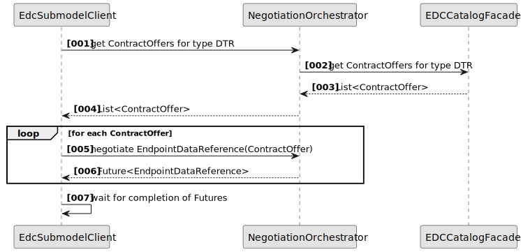

# #894 Efficient orchestration of edc negotiations

| Key           | Value                                                                    |
|---------------|--------------------------------------------------------------------------|
| Creation date | 05.020.2025                                                              |
| Ticket Id     | https://github.com/eclipse-tractusx/item-relationship-service/issues/894 |    
| State         | DONE                                                                     | 

## Table of Contents

1. [Decision](#Decision)
2. [Rationale](#Rationale)
3. [Approach](#Approach)
4. [Testing Strategy](#Testing-Strategy)

## Decision

Implementation of a new EDC Orchestrator within the IRS EDC Client Library for efficient management of negotiations. The
goal is to avoid redundant and unnecessary negotiations, thereby ensuring more efficient processing in asset
consumption.

## Rationale

Each IRS job is executed in isolation. This results in many jobs conducting a multitude of unnecessary contract
negotiations for the same DT Registry Asset in the EDC catalog. In case the same catalog offer is requested in different
jobs this leads to not performant overall executions. Therefore, a concept is required how to handle this in the most
efficient way.

## Approach

A new service “NegotiationOrchestrator” is introduced which is a middle layer between the already existing components
EdcSubmodelClientImpl and ContractNegotiationService, EDCCatalogFacade and EndpointDataReferenceCacheService.

The service handles the following tasks:

- orchestration of catalog requests by asset ID
- orchestration of catalog requests by asset type
- orchestration of contract negotiations
- caching of ongoing contract negotiations
- caching of EDR tokens

To prevent too many parallel requests to the EDC, an ExecutorService handles the catalog requests and negotiations with
a defined thread pool.

To store the currently ongoing negotiations, a Cache with EDC AssetIds as key can be used. For a first MVP an in-memory
Cache (e.g. ConcurrentHashMap) can be used. Due to the asynchronous process within NegotiationOrchestrator, the future
EDR can be created and added to the cache as soon as the method is called and will be removed only after the negotiation
is completed. In addition, a configurable time to live should be added to the stored EDR. This enables a cleanup
mechanism to remove outdated EDRs from the cache which will ensure that a new negotiation will take place after the
defined TTL.

To cache EDR tokens, the EndpointDataReferenceCacheService can be used. The caching service wraps EDR tokens into an
object with a state indicating if the token is valid (i.e. can be used directly to authenticate the dataplane request)
or expired (i.e. the validityPeriod is expired). After expiration the token can be reused to request a new token. Cache
eviction is handled independent of token state and will use a configurable TTL to evict cached entries.

See [docs/src/uml-diagrams/runtime-view/edc-flow-orchestrated.puml](https://github.com/eclipse-tractusx/item-relationship-service/blob/main/docs/src/uml-diagrams/runtime-view/edc-flow-orchestrated.puml)
for sources.

### Special Case: Registry Negotiation

Contract offers for the digital twin registry are identified by a type. This changes the process slightly, so it is not
only one contract offer which will be negotiated, but potentially multiple contract offers.

Since the NegotiationOrchestrator works asynchronously, we can simply start the EDR negotiation process for all the
received contract offers and will receive a list of Future EDRs.

The process of NegotiationOrchestrator is left out of the chart, since it is the same as previous.

See [docs/src/uml-diagrams/runtime-view/edc-flow-orchestrated-ddtr.puml](https://github.com/eclipse-tractusx/item-relationship-service/blob/main/docs/src/uml-diagrams/runtime-view/edc-flow-orchestrated-ddtr.puml)
for sources.

## Testing Strategy

E2E Tests can be re-used, because the data we receive does not change. The only difference is, that fewer negotiations
are done.

For unit- and integration tests, the Wiremock tests “SubmodelFacadeWiremockTest” and “IrsWireMockIntegrationTest”
provide full control over all participating components and can therefore verify every interaction between them.

These tests allow to verify the that Tokens are reused, negotiations for the same Asset are only conducted once and
simultaneous requests to the DTR are still working.
The communication to EDC does not change so the already existing *Support Classes can be reused.

New scenarios have to be defined which aim to test the parallel execution of negotiations.

### Test case: start 2 IRS jobs with the same globalAssetId at the same time

Expected result is that both jobs complete, but for the second job, no new negotiations should be started .

Verify that the EDC endpoints for EDC stubs are only interacted with once by using the verification methods of
WiremockSupport.

Verify that the Cache has been used for the registry and submodel negotiation.

### Test case: start 2 IRS jobs with different globalAssetIds at the same time

Expected result is that both jobs complete and both had their full set of negotiations conducted.

Verify that the Cache has been used for the registry negotiation.

Verify that the submodel negotiations are done for each submodel.****